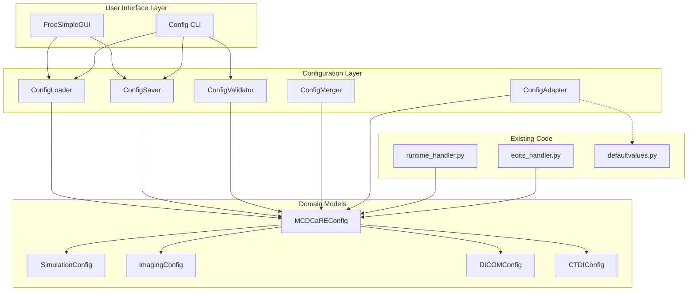
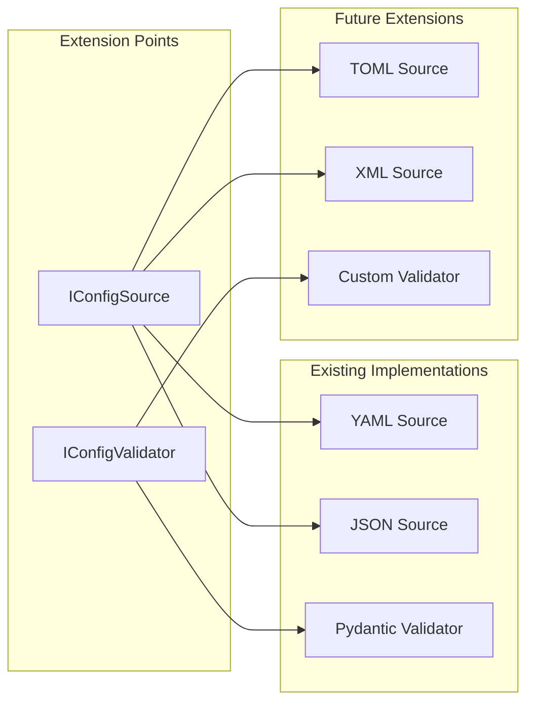
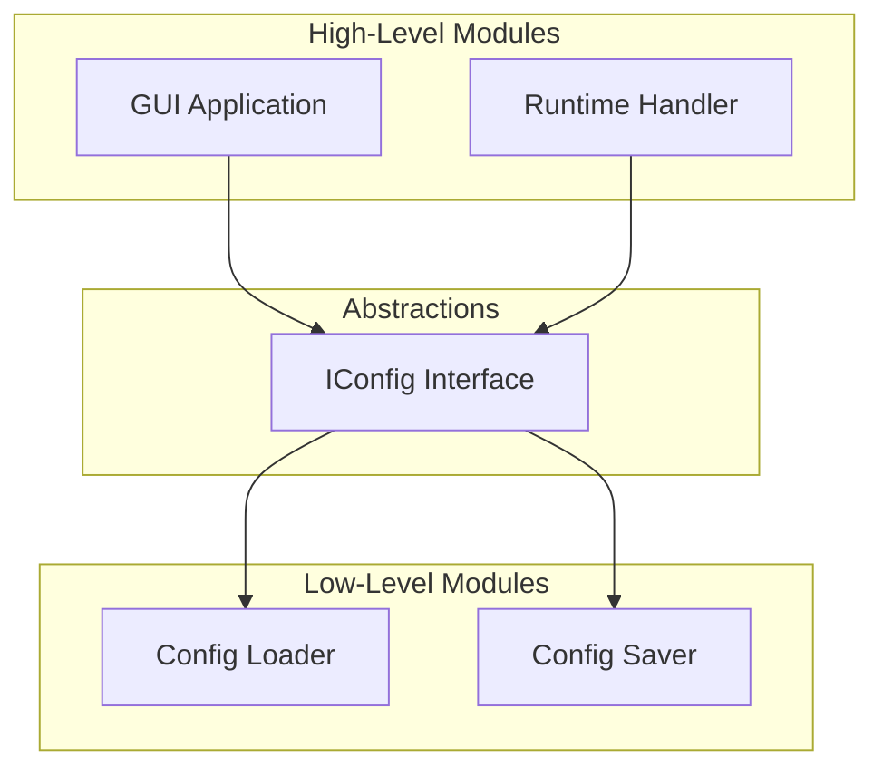
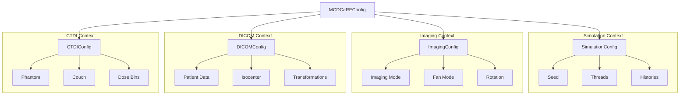
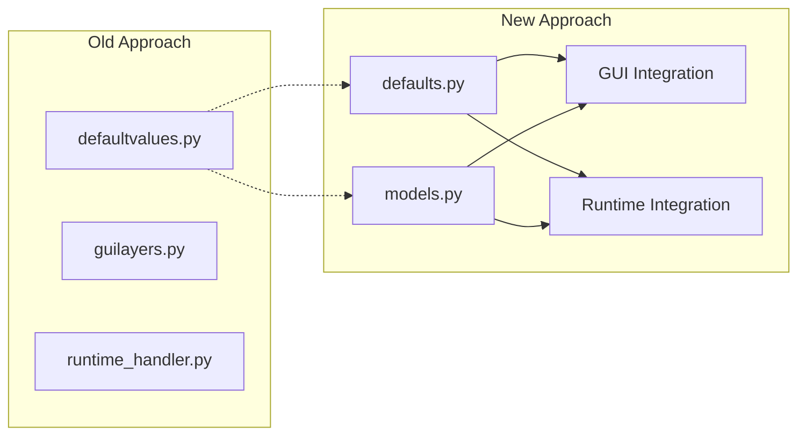
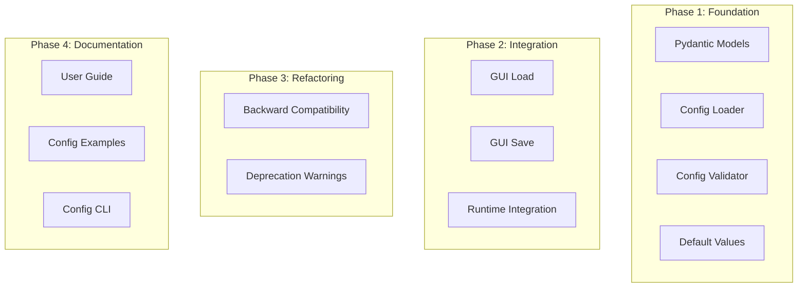
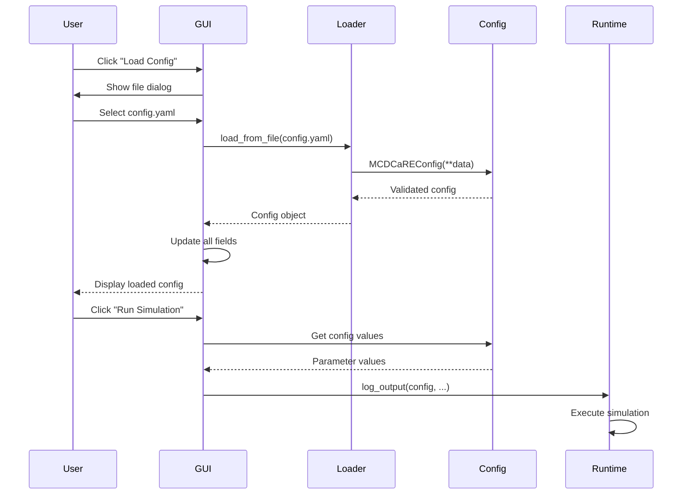
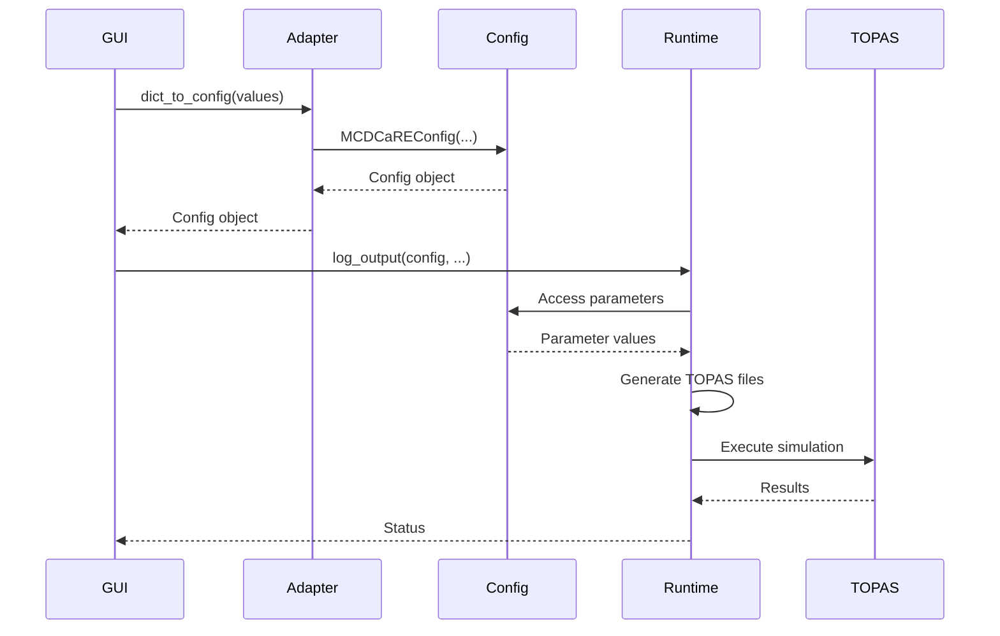
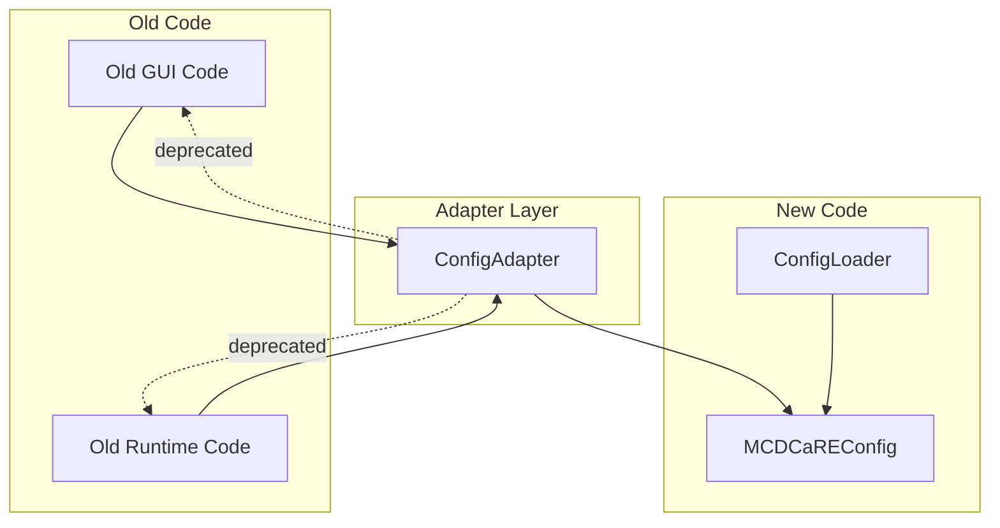
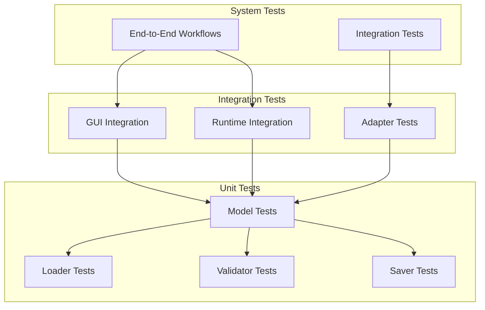

# Config File Architecture Overview

## High-Level Architecture



## SOLID Principles Applied

### Single Responsibility Principle (SRP)

Each module has one clear responsibility:

| Module | Responsibility |
|--------|----------------|
| [`ConfigLoader`](src/mc_dcare/core/configuration/loader.py) | Load config from files |
| [`ConfigSaver`](src/mc_dcare/core/configuration/saver.py) | Save config to files |
| [`ConfigValidator`](src/mc_dcare/core/configuration/validator.py) | Validate config data |
| [`ConfigMerger`](src/mc_dcare/core/configuration/merger.py) | Merge config with defaults |
| [`ConfigAdapter`](src/mc_dcare/core/configuration/adapters.py) | Bridge old/new interfaces |

### Open/Closed Principle (OCP)

The system is open for extension but closed for modification:



**Adding new config format** (e.g., TOML):
1. Implement `IConfigSource` interface
2. No changes to existing code

### Liskov Substitution Principle (LSP)

Config sources are interchangeable:

```python
# Any IConfigSource implementation can be used
def load_config(source: IConfigSource) -> MCDCaREConfig:
    return source.load()

# Works with YAML, JSON, TOML, etc.
yaml_source = YAMLConfigSource("config.yaml")
json_source = JSONConfigSource("config.json")

config1 = load_config(yaml_source)
config2 = load_config(json_source)
```

### Interface Segregation Principle (ISP)

Focused interfaces for different consumers:

```python
# Small, focused interfaces
class IConfigSource(Protocol):
    def load(self) -> MCDCaREConfig: ...

class IConfigValidator(Protocol):
    def validate(self, config: MCDCaREConfig) -> bool: ...

class IConfigSerializer(Protocol):
    def serialize(self, config: MCDCaREConfig) -> str: ...

# Consumers depend only on what they need
def gui_load(source: IConfigSource): ...
def runtime_validate(validator: IConfigValidator): ...
```

### Dependency Inversion Principle (DIP)

High-level modules depend on abstractions:



## DDD Domain Model

### Bounded Contexts



### Domain Language

| Term | Domain Meaning | Example |
|------|----------------|---------|
| `simulation_type` | Type of simulation to run | "DICOM", "CTDI validation" |
| `histories` | Number of particle histories | 100000 |
| `threads` | CPU threads to use | 4 |
| `kVp` | X-ray tube voltage | 100 kV |
| `mAs` | Tube current × time | 100 mAs |
| `fan_mode` | Bowtie filter type | "Full Fan", "Half Fan" |
| `isocenter` | Treatment isocenter coordinates | (0, 0, 0) mm |

## DRY Implementation

### Reusing Existing Parameter Definitions



**Key Reuse Points:**

1. **Default Values**: Refactored from [`defaultvalues.py`](src/defaultvalues.py:1) to Pydantic model defaults
2. **Validation Logic**: Extracted from GUI event handlers to Pydantic validators
3. **String Parsing**: [`quantity_unit_stripper()`](topas_gui.py:48) reused in config adapter
4. **Imaging Modes**: [`imaging_modes_lookuptable.py`](src/imaging_modes_lookuptable.py:1) used for validation

## YAGNI Boundaries

### What We're Implementing ✓



### What We're NOT Implementing ✗

- Config file versioning/migration
- Remote config loading
- Config file encryption
- GUI state persistence
- Config file diffing tools
- Config history tracking
- User-defined templates

## Refactoring Opportunities

### Current Code Issues

1. **Tight Coupling**: GUI keys scattered across modules
2. **Mixed Responsibilities**: [`runtime_handler.py`](src/runtime_handler.py:1) does too much
3. **No Validation**: Parameters validated only in GUI
4. **Hardcoded Values**: Magic strings throughout codebase

### Targeted Refactors

#### 1. Extract Parameter Keys
```python
# BEFORE: Scattered throughout code
'-G4FOLDERNAME-', '-TOPAS-', '-SEED-', ...

# AFTER: Centralized
class ConfigKeys:
    G4_FOLDER = '-G4FOLDERNAME-'
    TOPAS = '-TOPAS-'
    SEED = '-SEED-'
    # ...
```

#### 2. Separate File Operations
```python
# BEFORE: Mixed in runtime_handler.py
def log_output(...):
    os.makedirs(...)
    shutil.copy(...)
    # ... simulation logic

# AFTER: Separated concerns
class FileManager:
    def create_run_directory(...) -> Path: ...
    def copy_boilerplates(...) -> None: ...

class SimulationRunner:
    def run_simulation(...) -> None: ...
```

#### 3. Extract Validation
```python
# BEFORE: In GUI event handlers
if not 0 <= angle <= 360:
    sg.popup_error("Invalid angle")

# AFTER: In Pydantic model
@validator('start_angle')
def validate_angle(cls, v):
    if not -360 <= v <= 360:
        raise ValueError('Angle must be between -360 and 360')
    return v
```

## Integration Points

### GUI Integration



### Runtime Handler Integration



## Backward Compatibility Strategy

### Adapter Layer



### Migration Path

1. **Phase 1**: New config system exists alongside old code
2. **Phase 2**: GUI uses new config system (optional for users)
3. **Phase 3**: Adapter layer bridges old and new
4. **Phase 4**: Deprecation warnings added
5. **Future**: Old code removed (after transition period)

## Testing Strategy

### Test Pyramid



### Coverage Goals

| Test Type | Target Coverage |
|-----------|-----------------|
| Unit Tests | 90%+ |
| Integration Tests | 80%+ |
| System Tests | Key workflows |

## Success Metrics

### Technical Metrics
- Code coverage > 85%
- Zero breaking changes to existing GUI
- All existing tests pass
- Config load/save < 100ms

### User Metrics
- Config file load time < 1 second
- Validation error messages are clear
- Documentation completeness > 90%
- User adoption rate tracked

## Key Design Decisions

### 1. Pydantic for Models
**Decision**: Use Pydantic for domain models

**Rationale**:
- Built-in validation
- Type hints
- JSON serialization
- Active community

### 2. YAML as Primary Format
**Decision**: Support YAML and JSON, YAML as primary

**Rationale**:
- Human-readable
- Comments support
- Industry standard
- Easy to edit

### 3. Adapter Layer
**Decision**: Use adapter for backward compatibility

**Rationale**:
- Zero breaking changes
- Gradual migration path
- Clear deprecation path

### 4. Four-Phase Implementation
**Decision**: Implement in 4 phases over 4 weeks

**Rationale**:
- Incremental delivery
- Risk mitigation
- Early feedback
- Manageable scope
