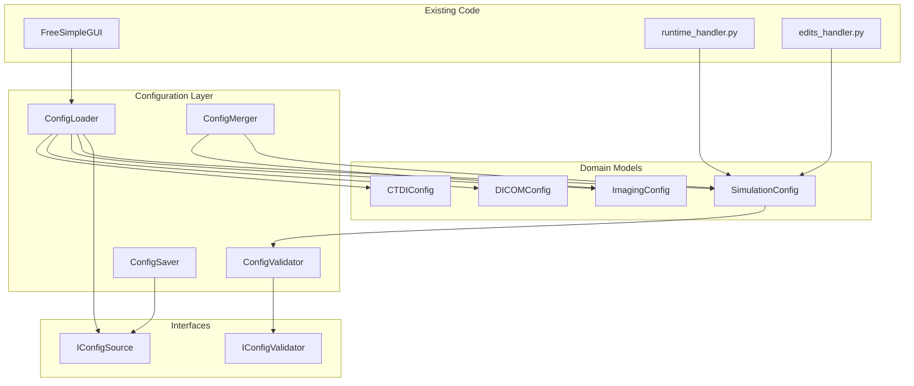

# Config File Support Implementation Plan

## Executive Summary

This document provides a detailed, phased implementation plan for adding configuration file support to MC-DCaRE. The plan follows SOLID principles, YAGNI, DRY, and DDD methodologies while maintaining backward compatibility with the existing GUI-based workflow.

---

## Current Architecture Analysis

### Existing Code Structure

```
src/
├── defaultvalues.py          # Default parameter definitions (module-level variables)
├── topas_gui.py             # Main GUI application
├── runtime_handler.py       # Simulation execution and file management
├── edits_handler.py         # TOPAS file editing logic
├── guilayers.py             # GUI layout definitions
├── imaging_modes_lookuptable.py  # Imaging mode parameter mappings
├── Energyspectrum.py        # Beam profile generation
├── fieldtobladeopening.py   # Blade position calculations
├── mc_dcare/                # (Empty) New module structure
│   ├── core/
│   │   ├── configuration/  # (Empty)
│   │   └── validation/     # (Empty)
│   └── cli/                 # (Empty)
```

### SOLID Principle Violations Identified

#### 1. Single Responsibility Principle (SRP)
- **Violation**: [`topas_gui.py`](topas_gui.py:1) handles GUI, event processing, file operations, and simulation orchestration
- **Violation**: [`runtime_handler.py`](runtime_handler.py:1) mixes file copying, command generation, and multiprocessing
- **Violation**: [`edits_handler.py`](edits_handler.py:1) combines string replacement logic with specific edit rules

#### 2. Open/Closed Principle (OCP)
- **Violation**: Adding new simulation types requires modifying [`runtime_handler.py`](runtime_handler.py:64) and [`edits_handler.py`](edits_handler.py:35)
- **Violation**: New imaging modes require modifying [`imaging_modes_lookuptable.py`](imaging_modes_lookuptable.py:1) and GUI code

#### 3. Liskov Substitution Principle (LSP)
- **Not Applicable**: No inheritance hierarchy exists

#### 4. Interface Segregation Principle (ISP)
- **Violation**: No clear interfaces; everything is tightly coupled through dictionaries
- **Violation**: GUI keys (`-DICOM-`, `-G4FOLDERNAME-`, etc.) are scattered across modules

#### 5. Dependency Inversion Principle (DIP)
- **Violation**: High-level modules (GUI) depend on low-level modules (file operations, string replacement)
- **Violation**: No abstractions for configuration management

### YAGNI Boundaries

**What to Implement (Immediate Need):**
- Load/save simulation parameters from config files
- Validate config file contents
- Merge config with defaults
- Support YAML/JSON formats

**What NOT to Implement (YAGNI):**
- Config file versioning/migration (not needed yet)
- Remote config loading (over-engineering)
- Config file encryption (unnecessary complexity)
- GUI state persistence (out of scope)
- Config file diffing/merging tools (future feature)

### DRY Opportunities

1. **Parameter Definitions**: [`defaultvalues.py`](defaultvalues.py:1) contains all defaults but is not used for validation
2. **Validation Logic**: Currently duplicated in GUI event handlers
3. **String Replacement**: [`quantity_unit_stripper()`](topas_gui.py:48) logic could be reused for config parsing
4. **Imaging Mode Mappings**: [`imaging_modes_lookuptable.py`](imaging_modes_lookuptable.py:1) could be used for config validation

### DDD Domain Model

**Bounded Contexts:**
1. **Simulation Configuration**: Runtime parameters (histories, threads, seed)
2. **Imaging Configuration**: kV, exposure, rotation, fan mode
3. **DICOM Configuration**: Patient data, isocenter, transformations
4. **CTDI Configuration**: Phantom type, couch settings, dose bins

**Domain Language:**
- `simulation_type`: DICOM | CTDI validation
- `imaging_mode`: Image Gently | Head | Thorax | Pelvis | etc.
- `fan_mode`: Full Fan | Half Fan
- `rotation_direction`: CBCT Clockwise | CBCT Anticlockwise | kV-kV
- `phantom_size`: 16 cm | 32 cm

---

## Configuration Module Architecture

### High-Level Design



### File Structure

```
src/
├── mc_dcare/
│   ├── __init__.py
│   ├── core/
│   │   ├── __init__.py
│   │   ├── configuration/
│   │   │   ├── __init__.py
│   │   │   ├── base.py              # Abstract base classes
│   │   │   ├── models.py            # Domain models (pydantic)
│   │   │   ├── loader.py            # Config file loading
│   │   │   ├── saver.py             # Config file saving
│   │   │   ├── validator.py         # Validation logic
│   │   │   ├── merger.py            # Config merging with defaults
│   │   │   └── defaults.py          # Default values (refactored from defaultvalues.py)
│   │   └── validation/
│   │       ├── __init__.py
│   │       ├── validators.py        # Custom validators
│   │       └── schemas.py           # Validation schemas
│   └── cli/
│       ├── __init__.py
│       └── config_cli.py            # CLI for config operations (optional)
├── defaultvalues.py                  # DEPRECATED: Keep for backward compatibility
├── topas_gui.py                      # MODIFY: Integrate config loading
├── runtime_handler.py                # MODIFY: Use config objects
└── edits_handler.py                  # MODIFY: Use config objects
```

---

## Phased Implementation Plan

### Phase 1: Foundation (Week 1)

**Goal**: Establish core configuration infrastructure without modifying existing code

**Milestones**:
- [ ] Create domain models with Pydantic
- [ ] Implement config loader (YAML/JSON)
- [ ] Implement config validator
- [ ] Create default values module
- [ ] Unit tests for core functionality

**Files to Create**:
- `src/mc_dcare/core/configuration/base.py`
- `src/mc_dcare/core/configuration/models.py`
- `src/mc_dcare/core/configuration/loader.py`
- `src/mc_dcare/core/configuration/validator.py`
- `src/mc_dcare/core/configuration/defaults.py`

**Files to Modify**:
- None (backward compatible)

**Code Example - Domain Model**:
```python
# src/mc_dcare/core/configuration/models.py
from pydantic import BaseModel, Field, validator
from typing import Literal, Optional
from enum import Enum

class FanMode(str, Enum):
    FULL_FAN = "Full Fan"
    HALF_FAN = "Half Fan"

class RotationDirection(str, Enum):
    CBCT_CLOCKWISE = "CBCT Clockwise"
    CBCT_ANTICLOCKWISE = "CBCT Anticlockwise"
    KV_KV = "kV-kV"

class ImagingMode(str, Enum):
    IMAGE_GENTLY = "Image Gently"
    HEAD = "Head"
    SHORT_THORAX = "Short Thorax"
    SPOTLIGHT = "Spotlight"
    THORAX = "Thorax"
    PELVIS = "Pelvis"
    PELVIS_LARGE = "Pelvis Large"

class SimulationConfig(BaseModel):
    """Core simulation parameters"""
    g4_data_directory: str = Field(default="/root/G4Data", description="Geant4 data directory")
    topas_directory: str = Field(default="/root/topas/bin/topas", description="TOPAS binary path")
    seed: int = Field(default=9, ge=0, description="Random seed")
    threads: int = Field(default=1, ge=1, description="Number of threads")
    histories: int = Field(default=100000, ge=1, description="Number of histories")
    
    class Config:
        validate_assignment = True

class ImagingConfig(BaseModel):
    """Imaging parameters"""
    mode: ImagingMode = Field(default=ImagingMode.IMAGE_GENTLY)
    fan_mode: FanMode = Field(default=FanMode.FULL_FAN)
    rotation_direction: RotationDirection = Field(default=RotationDirection.CBCT_CLOCKWISE)
    start_angle: float = Field(default=0.0, description="Start angle in degrees")
    voltage: float = Field(default=100.0, ge=0, description="kVp")
    exposure: float = Field(default=100.0, ge=0, description="mAs")
    
    @validator('start_angle')
    def validate_angle(cls, v):
        if not -360 <= v <= 360:
            raise ValueError('Angle must be between -360 and 360 degrees')
        return v

class DICOMConfig(BaseModel):
    """DICOM-specific configuration"""
    directory: str = Field(default="/sampledicom/setA")
    rp_file: str = Field(default="/sampledicom/RP.sample.dcm")
    patient_id: Optional[str] = None
    translation_x: str = Field(default="0. mm")
    translation_y: str = Field(default="0. mm")
    translation_z: str = Field(default="0. mm")
    rotation_yaw: str = Field(default="0. deg")
    isocenter_x: str = Field(default="0. mm")
    isocenter_y: str = Field(default="0. mm")
    isocenter_z: str = Field(default="0. mm")

class CTDIConfig(BaseModel):
    """CTDI phantom configuration"""
    phantom_size: Literal["16 cm", "32 cm"] = Field(default="16 cm")
    couch_enabled: bool = Field(default=True)
    couch_hlx: str = Field(default="260. mm")
    couch_hly: str = Field(default="0.4 mm")
    couch_hlz: str = Field(default="1000 mm")
    dtm_zbins: int = Field(default=100, ge=1)
    tle_zbins: int = Field(default=100, ge=1)
    dtw_zbins: int = Field(default=100, ge=1)
    user_blade_enabled: bool = Field(default=False)

class MCDCaREConfig(BaseModel):
    """Root configuration object"""
    simulation: SimulationConfig = Field(default_factory=SimulationConfig)
    imaging: ImagingConfig = Field(default_factory=ImagingConfig)
    dicom: Optional[DICOMConfig] = None
    ctdi: Optional[CTDIConfig] = None
    simulation_type: Literal["DICOM", "CTDI validation"] = Field(default="DICOM")
    
    @validator('simulation_type')
    def validate_config_consistency(cls, v, values):
        if v == "DICOM" and values.get('ctdi') is not None:
            raise ValueError('CTDI config not allowed for DICOM simulation')
        if v == "CTDI validation" and values.get('dicom') is not None:
            raise ValueError('DICOM config not allowed for CTDI simulation')
        return v
```

**Code Example - Config Loader**:
```python
# src/mc_dcare/core/configuration/loader.py
from pathlib import Path
from typing import Union
import yaml
import json
from .models import MCDCaREConfig

class ConfigLoader:
    """Load configuration from YAML or JSON files"""
    
    @staticmethod
    def load_from_file(file_path: Union[str, Path]) -> MCDCaREConfig:
        """Load config from file (auto-detect format)"""
        file_path = Path(file_path)
        
        if not file_path.exists():
            raise FileNotFoundError(f"Config file not found: {file_path}")
        
        if file_path.suffix in ['.yaml', '.yml']:
            return ConfigLoader._load_yaml(file_path)
        elif file_path.suffix == '.json':
            return ConfigLoader._load_json(file_path)
        else:
            raise ValueError(f"Unsupported file format: {file_path.suffix}")
    
    @staticmethod
    def _load_yaml(file_path: Path) -> MCDCaREConfig:
        with open(file_path, 'r') as f:
            data = yaml.safe_load(f)
        return MCDCaREConfig(**data)
    
    @staticmethod
    def _load_json(file_path: Path) -> MCDCaREConfig:
        with open(file_path, 'r') as f:
            data = json.load(f)
        return MCDCaREConfig(**data)
    
    @staticmethod
    def load_from_dict(data: dict) -> MCDCaREConfig:
        """Load config from dictionary"""
        return MCDCaREConfig(**data)
```

**Code Example - Defaults Module**:
```python
# src/mc_dcare/core/configuration/defaults.py
"""Default configuration values - refactored from defaultvalues.py"""

# Import from models for DRY
from .models import (
    SimulationConfig, ImagingConfig, DICOMConfig, CTDIConfig, MCDCaREConfig
)

def get_default_config() -> MCDCaREConfig:
    """Get default configuration"""
    return MCDCaREConfig()

def get_simulation_defaults() -> SimulationConfig:
    """Get simulation defaults"""
    return SimulationConfig()

def get_imaging_defaults() -> ImagingConfig:
    """Get imaging defaults"""
    return ImagingConfig()

def get_dicom_defaults() -> DICOMConfig:
    """Get DICOM defaults"""
    return DICOMConfig()

def get_ctdi_defaults() -> CTDIConfig:
    """Get CTDI defaults"""
    return CTDIConfig()
```

**Testing Strategy - Phase 1**:
```python
# tests/unit/test_config_models.py
import pytest
from src.mc_dcare.core.configuration.models import (
    SimulationConfig, ImagingConfig, DICOMConfig, CTDIConfig, MCDCaREConfig
)

def test_simulation_config_defaults():
    config = SimulationConfig()
    assert config.seed == 9
    assert config.threads == 1
    assert config.histories == 100000

def test_simulation_config_validation():
    with pytest.raises(ValueError):
        SimulationConfig(threads=-1)
    
    with pytest.raises(ValueError):
        SimulationConfig(histories=0)

def test_imaging_config_validation():
    with pytest.raises(ValueError):
        ImagingConfig(start_angle=400)

def test_config_consistency():
    # DICOM simulation should not have CTDI config
    with pytest.raises(ValueError):
        MCDCaREConfig(
            simulation_type="DICOM",
            ctdi=CTDIConfig()
        )

# tests/unit/test_config_loader.py
import pytest
from pathlib import Path
from src.mc_dcare.core.configuration.loader import ConfigLoader

def test_load_yaml_config():
    # Create test config
    config_path = Path("tests/fixtures/test_config.yaml")
    config = ConfigLoader.load_from_file(config_path)
    assert isinstance(config, MCDCaREConfig)

def test_load_invalid_format():
    with pytest.raises(ValueError):
        ConfigLoader.load_from_file("test.txt")
```

---

### Phase 2: Integration (Week 2)

**Goal**: Integrate config system with existing GUI and runtime handler

**Milestones**:
- [ ] Add config file loading to GUI
- [ ] Add config file saving from GUI
- [ ] Modify runtime_handler to use config objects
- [ ] Modify edits_handler to use config objects
- [ ] Integration tests

**Files to Create**:
- `src/mc_dcare/core/configuration/saver.py`
- `src/mc_dcare/core/configuration/merger.py`
- `tests/integration/test_gui_config_integration.py`

**Files to Modify**:
- `topas_gui.py` - Add Load/Save config buttons
- `runtime_handler.py` - Accept config objects
- `edits_handler.py` - Accept config objects

**Code Example - Config Saver**:
```python
# src/mc_dcare/core/configuration/saver.py
from pathlib import Path
from typing import Union
import yaml
import json
from .models import MCDCaREConfig

class ConfigSaver:
    """Save configuration to YAML or JSON files"""
    
    @staticmethod
    def save_to_file(config: MCDCaREConfig, file_path: Union[str, Path]):
        """Save config to file (auto-detect format)"""
        file_path = Path(file_path)
        
        if file_path.suffix in ['.yaml', '.yml']:
            ConfigSaver._save_yaml(config, file_path)
        elif file_path.suffix == '.json':
            ConfigSaver._save_json(config, file_path)
        else:
            raise ValueError(f"Unsupported file format: {file_path.suffix}")
    
    @staticmethod
    def _save_yaml(config: MCDCaREConfig, file_path: Path):
        with open(file_path, 'w') as f:
            yaml.dump(config.dict(), f, default_flow_style=False)
    
    @staticmethod
    def _save_json(config: MCDCaREConfig, file_path: Path):
        with open(file_path, 'w') as f:
            json.dump(config.dict(), f, indent=2)
```

**Code Example - Config Merger**:
```python
# src/mc_dcare/core/configuration/merger.py
from typing import Dict, Any
from .models import MCDCaREConfig
from .defaults import get_default_config

class ConfigMerger:
    """Merge user config with defaults"""
    
    @staticmethod
    def merge_with_defaults(user_config: Dict[str, Any]) -> MCDCaREConfig:
        """Merge user config with defaults, user config takes precedence"""
        defaults = get_default_config().dict()
        
        # Deep merge
        merged = ConfigMerger._deep_merge(defaults, user_config)
        
        return MCDCaREConfig(**merged)
    
    @staticmethod
    def _deep_merge(base: Dict, update: Dict) -> Dict:
        """Deep merge two dictionaries"""
        result = base.copy()
        
        for key, value in update.items():
            if key in result and isinstance(result[key], dict) and isinstance(value, dict):
                result[key] = ConfigMerger._deep_merge(result[key], value)
            else:
                result[key] = value
        
        return result
```

**Code Example - GUI Integration**:
```python
# topas_gui.py - Additions only
from src.mc_dcare.core.configuration.loader import ConfigLoader
from src.mc_dcare.core.configuration.saver import ConfigSaver
from src.mc_dcare.core.configuration.models import MCDCaREConfig

# Add to main_layout
config_layer = sg.Frame('Configuration',
                [
                  [sg.Button('Load Config', key='-LOAD_CONFIG-'), 
                   sg.Button('Save Config', key='-SAVE_CONFIG-')],
                  [sg.Text('', key='-CONFIG_STATUS-', text_color='green')],
                ])

# Add to event loop
if event == '-LOAD_CONFIG-':
    config_file = sg.popup_get_file('Select config file', file_types=(('YAML', '*.yaml'), ('JSON', '*.json')))
    if config_file:
        try:
            config = ConfigLoader.load_from_file(config_file)
            # Update GUI values from config
            window['-G4FOLDERNAME-'].update(config.simulation.g4_data_directory)
            window['-TOPAS-'].update(config.simulation.topas_directory)
            window['-SEED-'].update(str(config.simulation.seed))
            window['-THREAD-'].update(str(config.simulation.threads))
            window['-HIST-'].update(str(config.simulation.histories))
            
            # Update imaging values
            window['-IMAGEMODE-'].update(config.imaging.mode.value)
            window['-FAN-'].update(config.imaging.fan_mode.value)
            window['-DIRECTROT-'].update(config.imaging.rotation_direction.value)
            window['-STARTANGLEROT-'].update(f"{config.imaging.start_angle} deg")
            window['-IMAGEVOLTAGE-'].update(f"{config.imaging.voltage} kV")
            window['-EXPOSURE-'].update(f"{config.imaging.exposure} mAs")
            
            # Update simulation type
            window['-FUNCTION_CHECK-'].update(config.simulation_type)
            
            # Trigger visibility updates
            if config.simulation_type == 'DICOM':
                window['-DICOM_TAB-'].update(visible=True)
                if config.dicom:
                    window['-DICOM-'].update(config.dicom.directory)
                    window['-DICOMRP-'].update(config.dicom.rp_file)
                    window['-DICOM_TX-'].update(config.dicom.translation_x)
                    window['-DICOM_TY-'].update(config.dicom.translation_y)
                    window['-DICOM_TZ-'].update(config.dicom.translation_z)
                    window['-DICOM_YAW-'].update(config.dicom.rotation_yaw)
            elif config.simulation_type == 'CTDI validation':
                window['-CTDI_TAB-'].update(visible=True)
                if config.ctdi:
                    window['-CTDI_PHANTOM-'].update(config.ctdi.phantom_size)
                    window['-DTMZB-'].update(str(config.ctdi.dtm_zbins))
                    window['-TLEZB-'].update(str(config.ctdi.tle_zbins))
                    window['-DTWZB-'].update(str(config.ctdi.dtw_zbins))
                    window['-COUCH_TOG-'].update(config.ctdi.couch_enabled)
                    window['-CTDI_BLADE_TOG-'].update(config.ctdi.user_blade_enabled)
            
            window['-CONFIG_STATUS-'].update(f"Loaded: {config_file}")
        except Exception as e:
            sg.popup_error(f"Error loading config: {str(e)}")

if event == '-SAVE_CONFIG-':
    config_file = sg.popup_get_file('Save config file', save_as=True, 
                                    file_types=(('YAML', '*.yaml'), ('JSON', '*.json')))
    if config_file:
        try:
            # Build config from current GUI values
            config = MCDCaREConfig(
                simulation_type=values['-FUNCTION_CHECK-'],
                simulation={
                    'g4_data_directory': values['-G4FOLDERNAME-'],
                    'topas_directory': values['-TOPAS-'],
                    'seed': int(values['-SEED-']),
                    'threads': int(values['-THREAD-']),
                    'histories': int(values['-HIST-']),
                },
                imaging={
                    'mode': values['-IMAGEMODE-'],
                    'fan_mode': values['-FAN-'],
                    'rotation_direction': values['-DIRECTROT-'],
                    'start_angle': quantity_unit_stripper(values['-STARTANGLEROT-'])[0],
                    'voltage': quantity_unit_stripper(values['-IMAGEVOLTAGE-'])[0],
                    'exposure': quantity_unit_stripper(values['-EXPOSURE-'])[0],
                }
            )
            
            if values['-FUNCTION_CHECK-'] == 'DICOM':
                config.dicom = {
                    'directory': values['-DICOM-'],
                    'rp_file': values['-DICOMRP-'],
                    'translation_x': values['-DICOM_TX-'],
                    'translation_y': values['-DICOM_TY-'],
                    'translation_z': values['-DICOM_TZ-'],
                    'rotation_yaw': values['-DICOM_YAW-'],
                    'isocenter_x': values['-DICOM_ISOX-'],
                    'isocenter_y': values['-DICOM_ISOY-'],
                    'isocenter_z': values['-DICOM_ISOZ-'],
                }
            elif values['-FUNCTION_CHECK-'] == 'CTDI validation':
                config.ctdi = {
                    'phantom_size': values['-CTDI_PHANTOM-'],
                    'couch_enabled': values['-COUCH_TOG-'],
                    'couch_hlx': values['-COUCHHLX-'],
                    'couch_hly': values['-COUCHHLY-'],
                    'couch_hlz': values['-COUCHHLZ-'],
                    'dtm_zbins': int(values['-DTMZB-']),
                    'tle_zbins': int(values['-TLEZB-']),
                    'dtw_zbins': int(values['-DTWZB-']),
                    'user_blade_enabled': values['-CTDI_BLADE_TOG-'],
                }
            
            ConfigSaver.save_to_file(config, config_file)
            window['-CONFIG_STATUS-'].update(f"Saved: {config_file}")
        except Exception as e:
            sg.popup_error(f"Error saving config: {str(e)}")
```

**Code Example - Runtime Handler Integration**:
```python
# runtime_handler.py - Modified signature
from src.mc_dcare.core.configuration.models import MCDCaREConfig

def log_output(config: MCDCaREConfig, input_file_path: str, topas_application_path: str):
    """Run simulation using configuration object"""
    rundatadir = os.path.join(
        os.getcwd() + "/runfolder",
        datetime.now().strftime('%Y-%m-%d_%H-%M-%S'))
    os.makedirs(rundatadir)
    shutil.copy(input_file_path, rundatadir)
    path = os.getcwd()
    
    # Use config object instead of individual parameters
    if config.simulation_type == 'dicom':
        # ... existing logic using config values
        fan_tag = config.imaging.fan_mode.value
        # ...
    
    elif config.simulation_type == 'ctdi16' or config.simulation_type == 'ctdi32':
        phantom_size = 'ctdi16' if config.ctdi.phantom_size == '16 cm' else 'ctdi32'
        fan_tag = config.imaging.fan_mode.value
        # ...
```

**Testing Strategy - Phase 2**:
```python
# tests/integration/test_gui_config_integration.py
import pytest
from pathlib import Path
from src.mc_dcare.core.configuration.loader import ConfigLoader
from src.mc_dcare.core.configuration.saver import ConfigSaver
from src.mc_dcare.core.configuration.models import MCDCaREConfig

def test_roundtrip_config():
    """Test that config can be saved and loaded correctly"""
    original = MCDCaREConfig(
        simulation_type="DICOM",
        simulation={'histories': 50000},
        imaging={'voltage': 120.0}
    )
    
    test_file = Path("tests/fixtures/test_roundtrip.yaml")
    ConfigSaver.save_to_file(original, test_file)
    
    loaded = ConfigLoader.load_from_file(test_file)
    
    assert loaded.simulation.histories == 50000
    assert loaded.imaging.voltage == 120.0
    
    test_file.unlink()

def test_config_merger():
    """Test that user config overrides defaults"""
    from src.mc_dcare.core.configuration.merger import ConfigMerger
    
    user_config = {
        'simulation': {'histories': 50000},
        'imaging': {'voltage': 120.0}
    }
    
    merged = ConfigMerger.merge_with_defaults(user_config)
    
    assert merged.simulation.histories == 50000  # User value
    assert merged.simulation.seed == 9  # Default value
    assert merged.imaging.voltage == 120.0  # User value
    assert merged.imaging.mode.value == "Image Gently"  # Default value
```

---

### Phase 3: Refactoring (Week 3)

**Goal**: Refactor existing code to use config system while maintaining backward compatibility

**Milestones**:
- [ ] Refactor defaultvalues.py to use config defaults
- [ ] Extract validation logic from GUI
- [ ] Create adapter layer for backward compatibility
- [ ] Add deprecation warnings
- [ ] Update documentation

**Files to Create**:
- `src/mc_dcare/core/configuration/adapters.py`
- `docs/changelog.md`

**Files to Modify**:
- `src/defaultvalues.py` - Add deprecation notice
- `src/edits_handler.py` - Refactor to use config objects
- `src/runtime_handler.py` - Refactor to use config objects

**Code Example - Adapter for Backward Compatibility**:
```python
# src/mc_dcare/core/configuration/adapters.py
"""Adapter layer for backward compatibility with existing code"""

import warnings
from typing import Dict, Any
from .models import MCDCaREConfig
from .loader import ConfigLoader

class ConfigAdapter:
    """Adapter for converting between old dict-based and new config-based approaches"""
    
    @staticmethod
    def dict_to_config(values: Dict[str, Any]) -> MCDCaREConfig:
        """Convert GUI values dict to config object"""
        warnings.warn(
            "Using dict-based config is deprecated. Use MCDCaREConfig directly.",
            DeprecationWarning,
            stacklevel=2
        )
        
        # Map old GUI keys to new config structure
        config_data = {
            'simulation_type': values.get('-FUNCTION_CHECK-', 'DICOM'),
            'simulation': {
                'g4_data_directory': values.get('-G4FOLDERNAME-', '/root/G4Data'),
                'topas_directory': values.get('-TOPAS-', '/root/topas/bin/topas'),
                'seed': int(values.get('-SEED-', 9)),
                'threads': int(values.get('-THREAD-', 1)),
                'histories': int(values.get('-HIST-', 100000)),
            },
            'imaging': {
                'mode': values.get('-IMAGEMODE-', 'Image Gently'),
                'fan_mode': values.get('-FAN-', 'Full Fan'),
                'rotation_direction': values.get('-DIRECTROT-', 'CBCT Clockwise'),
                'start_angle': ConfigAdapter._extract_value(values.get('-STARTANGLEROT-', '0 deg')),
                'voltage': ConfigAdapter._extract_value(values.get('-IMAGEVOLTAGE-', '100 kV')),
                'exposure': ConfigAdapter._extract_value(values.get('-EXPOSURE-', '100 mAs')),
            }
        }
        
        # Add DICOM or CTDI config based on simulation type
        if values.get('-FUNCTION_CHECK-') == 'DICOM':
            config_data['dicom'] = {
                'directory': values.get('-DICOM-', '/sampledicom/setA'),
                'rp_file': values.get('-DICOMRP-', '/sampledicom/RP.sample.dcm'),
                'patient_id': values.get('-PATID-'),
                'translation_x': values.get('-DICOM_TX-', '0. mm'),
                'translation_y': values.get('-DICOM_TY-', '0. mm'),
                'translation_z': values.get('-DICOM_TZ-', '0. mm'),
                'rotation_yaw': values.get('-DICOM_YAW-', '0. deg'),
                'isocenter_x': values.get('-DICOM_ISOX-', '0. mm'),
                'isocenter_y': values.get('-DICOM_ISOY-', '0. mm'),
                'isocenter_z': values.get('-DICOM_ISOZ-', '0. mm'),
            }
        elif values.get('-FUNCTION_CHECK-') == 'CTDI validation':
            config_data['ctdi'] = {
                'phantom_size': values.get('-CTDI_PHANTOM-', '16 cm'),
                'couch_enabled': values.get('-COUCH_TOG-', True),
                'couch_hlx': values.get('-COUCHHLX-', '260. mm'),
                'couch_hly': values.get('-COUCHHLY-', '0.4 mm'),
                'couch_hlz': values.get('-COUCHHLZ-', '1000 mm'),
                'dtm_zbins': int(values.get('-DTMZB-', 100)),
                'tle_zbins': int(values.get('-TLEZB-', 100)),
                'dtw_zbins': int(values.get('-DTWZB-', 100)),
                'user_blade_enabled': values.get('-CTDI_BLADE_TOG-', False),
            }
        
        return MCDCaREConfig(**config_data)
    
    @staticmethod
    def config_to_dict(config: MCDCaREConfig) -> Dict[str, Any]:
        """Convert config object to GUI values dict"""
        warnings.warn(
            "Using dict-based config is deprecated. Use MCDCaREConfig directly.",
            DeprecationWarning,
            stacklevel=2
        )
        
        values = {
            '-FUNCTION_CHECK-': config.simulation_type,
            '-G4FOLDERNAME-': config.simulation.g4_data_directory,
            '-TOPAS-': config.simulation.topas_directory,
            '-SEED-': str(config.simulation.seed),
            '-THREAD-': str(config.simulation.threads),
            '-HIST-': str(config.simulation.histories),
            '-IMAGEMODE-': config.imaging.mode.value,
            '-FAN-': config.imaging.fan_mode.value,
            '-DIRECTROT-': config.imaging.rotation_direction.value,
            '-STARTANGLEROT-': f"{config.imaging.start_angle} deg",
            '-IMAGEVOLTAGE-': f"{config.imaging.voltage} kV",
            '-EXPOSURE-': f"{config.imaging.exposure} mAs",
        }
        
        if config.dicom:
            values.update({
                '-DICOM-': config.dicom.directory,
                '-DICOMRP-': config.dicom.rp_file,
                '-PATID-': config.dicom.patient_id or '',
                '-DICOM_TX-': config.dicom.translation_x,
                '-DICOM_TY-': config.dicom.translation_y,
                '-DICOM_TZ-': config.dicom.translation_z,
                '-DICOM_YAW-': config.dicom.rotation_yaw,
                '-DICOM_ISOX-': config.dicom.isocenter_x,
                '-DICOM_ISOY-': config.dicom.isocenter_y,
                '-DICOM_ISOZ-': config.dicom.isocenter_z,
            })
        
        if config.ctdi:
            values.update({
                '-CTDI_PHANTOM-': config.ctdi.phantom_size,
                '-COUCH_TOG-': config.ctdi.couch_enabled,
                '-COUCHHLX-': config.ctdi.couch_hlx,
                '-COUCHHLY-': config.ctdi.couch_hly,
                '-COUCHHLZ-': config.ctdi.couch_hlz,
                '-DTMZB-': str(config.ctdi.dtm_zbins),
                '-TLEZB-': str(config.ctdi.tle_zbins),
                '-DTWZB-': str(config.ctdi.dtw_zbins),
                '-CTDI_BLADE_TOG-': config.ctdi.user_blade_enabled,
            })
        
        return values
    
    @staticmethod
    def _extract_value(string_with_unit: str) -> float:
        """Extract numeric value from string with unit (e.g., '100 kV' -> 100.0)"""
        for part in string_with_unit.split():
            try:
                return float(part)
            except ValueError:
                continue
        return 0.0
```

**Code Example - Deprecation Notice**:
```python
# src/defaultvalues.py - Add at top
"""
DEPRECATED: This module is deprecated and will be removed in a future version.

Please use src.mc_dcare.core.configuration.models and 
src.mc_dcare.core.configuration.defaults instead.

Migration guide:
- Import SimulationConfig from src.mc_dcare.core.configuration.models
- Use get_default_config() from src.mc_dcare.core.configuration.defaults

Example:
    OLD: from src.defaultvalues import default_Seed, default_Histories
    NEW: from src.mc_dcare.core.configuration.defaults import get_default_config
         config = get_default_config()
         seed = config.simulation.seed
         histories = config.simulation.histories
"""

import warnings
warnings.warn(
    "defaultvalues.py is deprecated. Use src.mc_dcare.core.configuration instead.",
    DeprecationWarning,
    stacklevel=2
)

# Keep existing values for backward compatibility
default_G4_Directory = '/root/G4Data'
# ... rest of existing values
```

**Testing Strategy - Phase 3**:
```python
# tests/unit/test_config_adapter.py
import pytest
import warnings
from src.mc_dcare.core.configuration.adapters import ConfigAdapter

def test_dict_to_config_with_deprecation_warning():
    """Test that adapter raises deprecation warning"""
    old_values = {
        '-FUNCTION_CHECK-': 'DICOM',
        '-SEED-': '42',
        '-HIST-': '50000',
    }
    
    with warnings.catch_warnings(record=True) as w:
        warnings.simplefilter("always")
        config = ConfigAdapter.dict_to_config(old_values)
        
        assert len(w) == 1
        assert issubclass(w[0].category, DeprecationWarning)
        assert "deprecated" in str(w[0].message).lower()
    
    assert config.simulation.seed == 42
    assert config.simulation.histories == 50000

def test_config_to_dict_with_deprecation_warning():
    """Test that adapter raises deprecation warning"""
    from src.mc_dcare.core.configuration.models import MCDCaREConfig
    
    config = MCDCaREConfig(simulation={'seed': 42, 'histories': 50000})
    
    with warnings.catch_warnings(record=True) as w:
        warnings.simplefilter("always")
        values = ConfigAdapter.config_to_dict(config)
        
        assert len(w) == 1
        assert issubclass(w[0].category, DeprecationWarning)
    
    assert values['-SEED-'] == '42'
    assert values['-HIST-'] == '50000'
```

---

### Phase 4: Documentation & CLI (Week 4)

**Goal**: Complete documentation and add optional CLI for config operations

**Milestones**:
- [ ] Write user guide for config files
- [ ] Write API documentation
- [ ] Create config file examples
- [ ] Add CLI for config validation/conversion
- [ ] Update README

**Files to Create**:
- `docs/config_file_guide.md`
- `docs/api/configuration.md`
- `examples/config/dicom_example.yaml`
- `examples/config/ctdi_example.yaml`
- `src/mc_dcare/cli/config_cli.py`

**Code Example - Config File Template**:
```yaml
# examples/config/dicom_example.yaml
# Example configuration file for DICOM simulation

# Simulation type: "DICOM" or "CTDI validation"
simulation_type: "DICOM"

# Core simulation parameters
simulation:
  g4_data_directory: "/path/to/G4Data"
  topas_directory: "/path/to/topas/bin/topas"
  seed: 9
  threads: 4
  histories: 100000

# Imaging parameters
imaging:
  mode: "Head"  # Options: Image Gently, Head, Short Thorax, Spotlight, Thorax, Pelvis, Pelvis Large
  fan_mode: "Full Fan"  # Options: Full Fan, Half Fan
  rotation_direction: "CBCT Clockwise"  # Options: CBCT Clockwise, CBCT Anticlockwise, kV-kV
  start_angle: 0.0  # degrees
  voltage: 100.0  # kVp
  exposure: 100.0  # mAs

# DICOM-specific parameters (only for DICOM simulation)
dicom:
  directory: "/path/to/dicom/folder"
  rp_file: "/path/to/RTPlan.dcm"
  patient_id: null  # Auto-populated from DICOM
  translation_x: "0. mm"
  translation_y: "0. mm"
  translation_z: "0. mm"
  rotation_yaw: "0. deg"
  isocenter_x: "0. mm"
  isocenter_y: "0. mm"
  isocenter_z: "0. mm"
```

```yaml
# examples/config/ctdi_example.yaml
# Example configuration file for CTDI validation

simulation_type: "CTDI validation"

simulation:
  g4_data_directory: "/path/to/G4Data"
  topas_directory: "/path/to/topas/bin/topas"
  seed: 9
  threads: 4
  histories: 100000

imaging:
  mode: "Head"
  fan_mode: "Full Fan"
  rotation_direction: "CBCT Clockwise"
  start_angle: 0.0
  voltage: 100.0
  exposure: 100.0

# CTDI-specific parameters (only for CTDI validation)
ctdi:
  phantom_size: "16 cm"  # Options: 16 cm, 32 cm
  couch_enabled: true
  couch_hlx: "260. mm"
  couch_hly: "0.4 mm"
  couch_hlz: "1000. mm"
  dtm_zbins: 100
  tle_zbins: 100
  dtw_zbins: 100
  user_blade_enabled: false
```

**Code Example - CLI**:
```python
# src/mc_dcare/cli/config_cli.py
"""CLI for configuration file operations"""

import argparse
import sys
from pathlib import Path
from src.mc_dcare.core.configuration.loader import ConfigLoader
from src.mc_dcare.core.configuration.saver import ConfigSaver
from src.mc_dcare.core.configuration.validator import ConfigValidator
from src.mc_dcare.core.configuration.defaults import get_default_config

def validate_command(args):
    """Validate a configuration file"""
    try:
        config = ConfigLoader.load_from_file(args.file)
        ConfigValidator.validate(config)
        print(f"✓ Configuration file is valid: {args.file}")
        return 0
    except Exception as e:
        print(f"✗ Validation failed: {str(e)}", file=sys.stderr)
        return 1

def convert_command(args):
    """Convert configuration between formats"""
    try:
        config = ConfigLoader.load_from_file(args.input)
        ConfigSaver.save_to_file(config, args.output)
        print(f"✓ Converted {args.input} to {args.output}")
        return 0
    except Exception as e:
        print(f"✗ Conversion failed: {str(e)}", file=sys.stderr)
        return 1

def generate_command(args):
    """Generate a default configuration file"""
    try:
        config = get_default_config()
        if args.type == "dicom":
            config.simulation_type = "DICOM"
        elif args.type == "ctdi":
            config.simulation_type = "CTDI validation"
        
        ConfigSaver.save_to_file(config, args.output)
        print(f"✓ Generated default configuration: {args.output}")
        return 0
    except Exception as e:
        print(f"✗ Generation failed: {str(e)}", file=sys.stderr)
        return 1

def main():
    parser = argparse.ArgumentParser(
        description="MC-DCaRE Configuration File CLI",
        formatter_class=argparse.RawDescriptionHelpFormatter,
        epilog="""
Examples:
  # Validate a config file
  python -m src.mc_dcare.cli.config_cli validate config.yaml
  
  # Convert YAML to JSON
  python -m src.mc_dcare.cli.config_cli convert config.yaml config.json
  
  # Generate default config
  python -m src.mc_dcare.cli.config_cli generate default.yaml --type dicom
        """
    )
    
    subparsers = parser.add_subparsers(dest='command', help='Available commands')
    
    # Validate command
    validate_parser = subparsers.add_parser('validate', help='Validate a configuration file')
    validate_parser.add_argument('file', type=str, help='Configuration file to validate')
    
    # Convert command
    convert_parser = subparsers.add_parser('convert', help='Convert between config formats')
    convert_parser.add_argument('input', type=str, help='Input file')
    convert_parser.add_argument('output', type=str, help='Output file')
    
    # Generate command
    generate_parser = subparsers.add_parser('generate', help='Generate default configuration')
    generate_parser.add_argument('output', type=str, help='Output file')
    generate_parser.add_argument('--type', choices=['dicom', 'ctdi'], default='dicom',
                                help='Simulation type (default: dicom)')
    
    args = parser.parse_args()
    
    if args.command == 'validate':
        return validate_command(args)
    elif args.command == 'convert':
        return convert_command(args)
    elif args.command == 'generate':
        return generate_command(args)
    else:
        parser.print_help()
        return 1

if __name__ == '__main__':
    sys.exit(main())
```

**Documentation Structure**:
```markdown
# docs/config_file_guide.md

## Configuration File Support

MC-DCaRE now supports loading and saving simulation parameters from configuration files (YAML or JSON format).

### Quick Start

1. **Generate a default config:**
   ```bash
   python -m src.mc_dcare.cli.config_cli generate my_config.yaml --type dicom
   ```

2. **Edit the config file** with your preferred parameters

3. **Load in GUI:**
   - Click "Load Config" button
   - Select your config file

4. **Save from GUI:**
   - Configure parameters in GUI
   - Click "Save Config" button
   - Choose file location

### Config File Format

#### DICOM Simulation
```yaml
simulation_type: "DICOM"
simulation:
  g4_data_directory: "/path/to/G4Data"
  topas_directory: "/path/to/topas/bin/topas"
  seed: 9
  threads: 4
  histories: 100000
imaging:
  mode: "Head"
  fan_mode: "Full Fan"
  # ...
dicom:
  directory: "/path/to/dicom"
  # ...
```

#### CTDI Validation
```yaml
simulation_type: "CTDI validation"
simulation:
  # ...
imaging:
  # ...
ctdi:
  phantom_size: "16 cm"
  # ...
```

### Validation

Config files are automatically validated when loaded. You can also validate manually:

```bash
python -m src.mc_dcare.cli.config_cli validate my_config.yaml
```

### Conversion

Convert between YAML and JSON:

```bash
python -m src.mc_dcare.cli.config_cli convert config.yaml config.json
```

### Parameter Reference

See [API Documentation](api/configuration.md) for complete parameter reference.
```

---

## Testing Strategy

### Unit Tests
- **Models**: Test all Pydantic models, validators, and field constraints
- **Loader**: Test YAML/JSON loading, error handling, format detection
- **Saver**: Test YAML/JSON saving, serialization
- **Merger**: Test deep merge logic, precedence rules
- **Adapter**: Test backward compatibility, deprecation warnings

### Integration Tests
- **GUI Integration**: Test load/save config from GUI
- **Runtime Handler**: Test simulation execution with config objects
- **Edits Handler**: Test file editing with config objects
- **Roundtrip**: Test save → load → save cycle

### System Tests
- **End-to-End**: Test complete workflow (load config → run simulation)
- **Backward Compatibility**: Test old code still works with adapter
- **Error Recovery**: Test graceful handling of invalid configs

### Test Coverage Goals
- Unit tests: 90%+ coverage
- Integration tests: 80%+ coverage
- System tests: Key workflows covered

---

## Risk Assessment & Mitigation

### Risk 1: Breaking Existing GUI Workflow
**Impact**: High
**Probability**: Medium
**Mitigation**: 
- Adapter layer maintains backward compatibility
- Deprecation warnings before removal
- Phase 2 maintains full GUI functionality

### Risk 2: Pydantic Learning Curve
**Impact**: Medium
**Probability**: Low
**Mitigation**:
- Clear documentation
- Code examples
- Training materials

### Risk 3: Performance Overhead
**Impact**: Low
**Probability**: Low
**Mitigation**:
- Pydantic is lightweight
- Validation only on load/save
- No runtime overhead during simulation

### Risk 4: Complex Migration Path
**Impact**: Medium
**Probability**: Low
**Mitigation**:
- Phased approach
- Clear documentation
- Adapter layer as bridge

---

## Success Criteria

### Phase 1 Success
- [ ] All unit tests pass
- [ ] Config models validated
- [ ] Loader/saver working
- [ ] Documentation complete

### Phase 2 Success
- [ ] GUI load/save working
- [ ] Runtime handler using config
- [ ] Integration tests pass
- [ ] No regressions in existing functionality

### Phase 3 Success
- [ ] Old code still works
- [ ] Deprecation warnings in place
- [ ] Adapter layer tested
- [ ] Migration guide complete

### Phase 4 Success
- [ ] User guide complete
- [ ] API documentation complete
- [ ] Examples provided
- [ ] CLI functional
- [ ] README updated

---

## Timeline Summary

| Phase | Duration | Key Deliverables |
|-------|----------|------------------|
| 1 | Week 1 | Core config infrastructure |
| 2 | Week 2 | GUI integration |
| 3 | Week 3 | Refactoring & backward compatibility |
| 4 | Week 4 | Documentation & CLI |

**Total Duration**: 4 weeks

---

## Future Enhancements (Out of Scope)

These are potential future features, not part of current implementation:

1. **Config Versioning**: Support for multiple config file versions
2. **Config Profiles**: Named profiles for common use cases
3. **Config Validation UI**: Visual validation feedback in GUI
4. **Config Diffing**: Compare two config files
5. **Remote Config**: Load configs from network locations
6. **Config Encryption**: Secure sensitive parameters
7. **Config Templates**: User-defined templates
8. **Config History**: Track config changes over time

---

## References

- [Pydantic Documentation](https://docs.pydantic.dev/)
- [SOLID Principles](https://en.wikipedia.org/wiki/SOLID)
- [Domain-Driven Design](https://martinfowler.com/tags/domain%20driven%20design.html)
- [YAML Specification](https://yaml.org/spec/)
- [JSON Schema](https://json-schema.org/)
