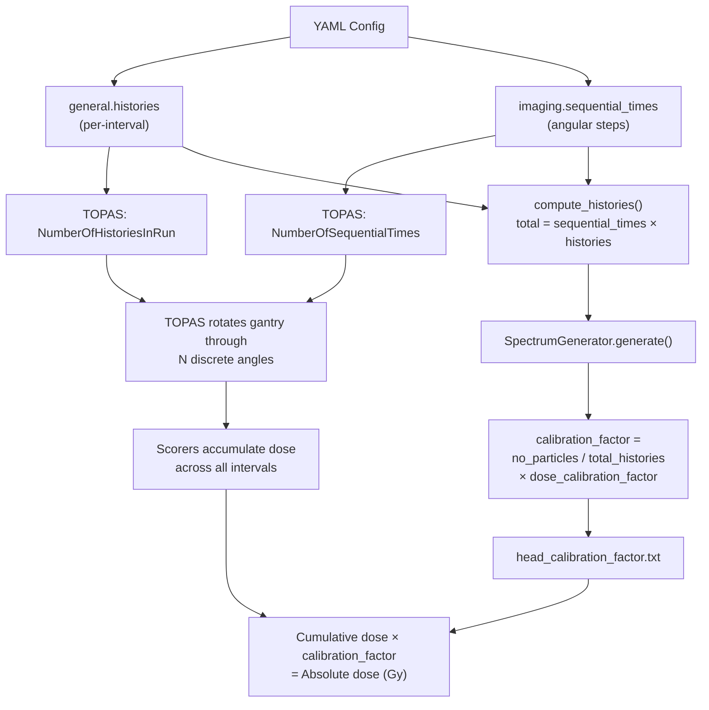

# Simulation Time Model: TOPAS Sequential Time Mode

## Overview

MC-DCaRE simulates Varian TrueBeam kV imaging beam delivery for CBCT and kV-kV acquisitions. To model the rotating gantry, the simulation uses **TOPAS Sequential Time Mode**, which discretises the continuous gantry rotation into a series of discrete angular steps. Each time step corresponds to a fixed gantry angle, and TOPAS runs the beam source at each angle sequentially within a single simulation session.

This document explains how MC-DCaRE configures Sequential Time Mode, how the configuration parameters map to TOPAS time-feature controls, and how the total number of histories affects the dose calibration factor.

## How Time Steps Map to Gantry Angles

During a CBCT acquisition, the kV source rotates around the patient (or phantom) over a defined angular range. MC-DCaRE models this rotation using a TOPAS **Time Feature** — a linear function of time that drives the `RotZ` component of the imaging geometry group:

```
dc:Ge/Rotation/RotZ = Tf/Rotate/Value deg
```

The time feature `Tf/Rotate` is defined as a linear function:

```
s:Tf/Rotate/Function = "Linear deg"
d:Tf/Rotate/Rate     = {{ rotation_rate }}
d:Tf/Rotate/StartValue = {{ start_angle }}
```

TOPAS evaluates this function at each sequential time point. With `NumberOfSequentialTimes` set to *N*, TOPAS divides the timeline from `TimelineStart` (default 0) to `TimelineEnd` into *N* equal intervals and evaluates the geometry — and therefore the gantry angle — at each interval. The result is a discrete approximation of the continuous rotation, where each interval represents one angular projection.

### Example

With default settings:

| Parameter | Value | Meaning |
|-----------|-------|---------|
| `sequential_times` | 1000 | 1000 angular projections |
| `timeline_end` | 501.0 s | End of timeline |
| `rotation_rate` | 0.4 deg/s | Gantry rotation speed |
| `start_angle` | 0 deg | Starting gantry angle |

The gantry rotates from 0° through approximately 200° (0.4 deg/s × 500 s) over 1000 discrete angular positions. Each position generates `histories` primary particles, and TOPAS accumulates the dose across all positions.

## Configuration Parameters

### YAML Config Keys

The following YAML configuration keys control the time model. They are defined in the `imaging` section of the config file:

| YAML Key | Default | TOPAS Parameter | Description |
|----------|---------|-----------------|-------------|
| `imaging.sequential_times` | `"1000"` | `Tf/NumberOfSequentialTimes` | Number of discrete angular steps (time intervals) |
| `imaging.timeline_end` | `"501.0 s"` | `Tf/TimelineEnd` | End of the simulation timeline |
| `imaging.rotation_rate` | `"0.4 deg/s"` | `Tf/Rotate/Rate` | Gantry angular velocity |
| `imaging.start_angle` | `"0 deg"` | `Tf/Rotate/StartValue` | Initial gantry angle |
| `general.histories` | `"100000"` | `So/beam/NumberOfHistoriesInRun` | Primary histories generated **per time interval** |

> **Note**: `TimelineStart` is not explicitly set in the MC-DCaRE template; TOPAS defaults it to 0.

### Template Rendering

These values are injected into the TOPAS parameter file via the Jinja2 template [`headsourcecode_boilerplate.j2`](../src/boilerplates/headsourcecode_boilerplate.j2). The relevant template lines are:

```topas
i:So/beam/NumberOfHistoriesInRun = {{ histories }}
i:Tf/NumberOfSequentialTimes = {{ sequential_times }}
d:Tf/TimelineEnd = {{ timeline_end }}
s:Tf/Rotate/Function = "Linear deg"
d:Tf/Rotate/Rate = {{ rotation_rate }}
d:Tf/Rotate/StartValue = {{ start_angle }}
```

## Total Histories Calculation

A critical distinction in Sequential Time Mode is the difference between **per-interval histories** and **total histories**:

- **Per-interval histories** (`general.histories`): The number of primary particles generated at each angular step. This is the value written to `So/beam/NumberOfHistoriesInRun` in the TOPAS parameter file.
- **Total histories**: The total number of primary particles across all angular steps for the entire simulation session.

```
total_histories = sequential_times × histories
```

Both [`CtdiMode.compute_histories()`](../src/modes/ctdi_mode.py:94) and [`DicomMode.compute_histories()`](../src/modes/dicom_mode.py:75) compute this product:

```python
def compute_histories(self, config: SimulationConfig) -> str:
    return str(int(config.imaging.sequential_times) * int(config.general.histories))
```

The [`Orchestrator`](../src/orchestrator.py:93) calls `mode.compute_histories(config)` and passes the result to [`SpectrumGenerator.generate()`](../src/spectrum_generator.py:17), which uses it to compute the calibration factor.

### Why This Matters

TOPAS scorers output **cumulative** results at the end of the entire session (all sequential time intervals). The scored dose is therefore the sum of contributions from all angular positions. To convert this cumulative scored dose into an absolute dose value, the calibration factor must account for the total number of histories across all intervals — not just the per-interval count.

## Calibration Factor

The calibration factor is written to `head_calibration_factor.txt` in the runfolder and is used to convert TOPAS scored dose (Gy per primary particle) into absolute dose (Gy).

### Computation

In [`SpectrumGenerator.generate()`](../src/spectrum_generator.py:48), the calibration factor is computed as:

```
calibration_factor = (no_particles / total_histories) × dose_calibration_factor
```

Where:

- **`no_particles`**: The expected number of photons computed from the SpekPy fluence: `4π × (0.1 m)² × fluence`. This represents the physical number of photons at 100 cm from the source for the given tube voltage and exposure.
- **`total_histories`**: `sequential_times × histories` — the total number of simulated primary particles across all angular steps.
- **`dose_calibration_factor`**: An optional multiplicative correction factor (default `1.0`) from `general.dose_calibration_factor` in the YAML config, used for measurement-to-simulation normalisation.

### Interpretation

The ratio `no_particles / total_histories` scales the Monte Carlo scored dose so that it represents the physical dose from the actual number of photons emitted during the acquisition. Because the scored dose accumulates across all `sequential_times` intervals, dividing by the total (not per-interval) histories ensures the calibration is correct.

### Calibration Factor File

The generated `head_calibration_factor.txt` contains:

```
<calibration_factor_scientific_notation>
Multiply dose by the factor above to get absolute dose
The number of histories in this run was: <total_histories>
Calibration factor = Number of particles/Histories
```

## CTDI vs DICOM Modes

Both simulation modes handle the time model identically:

| Aspect | CTDI Mode | DICOM Mode |
|--------|-----------|------------|
| Template | [`headsourcecode_boilerplate.j2`](../src/boilerplates/headsourcecode_boilerplate.j2) | [`headsourcecode_boilerplate.j2`](../src/boilerplates/headsourcecode_boilerplate.j2) |
| `compute_histories()` | `sequential_times × histories` | `sequential_times × histories` |
| Time feature parameters | Identical | Identical |
| Calibration factor | Uses total histories | Uses total histories |

The only difference is the geometry being scored: CTDI mode scores dose in a CTDI phantom (with parallel worlds for all 5 chamber plug positions), while DICOM mode scores dose in a patient DICOM geometry. The time model and history calculation are the same for both.

## Summary



## Related Topics

- [Changelog](changelog.md)
- [Configuration examples](../examples/config/)
- [TOPAS Time Features documentation](https://topas.readthedocs.io/) (external)
