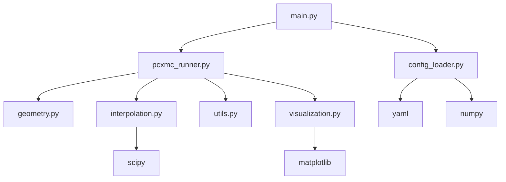

# PCXMC Simulation System - Module Specifications

This directory contains detailed specifications for all modules in the PCXMC simulation system.

## Module Overview

| Module | Purpose | Key Features |
|--------|---------|--------------|
| [geometry](geometry_spec.md) | Phantom and beam geometry calculations | 3D positioning, rotation matrices, coordinate transformations |
| [config_loader](config_loader_spec.md) | Configuration file loading and validation | YAML/MATLAB support, validation, key mapping |
| [interpolation](interpolation_spec.md) | Resolution scaling and interpolation | Linear interpolation, flexible resolution adjustment |
| [visualization](visualization_spec.md) | Plotting and visualization utilities | 2D/3D plots, customizable styling, multiple formats |
| [utils](utils_spec.md) | Mathematical utilities and helper functions | Trigonometric functions, angle wrapping |
| [main](main_spec.md) | Command-line interface | Argument parsing, error handling, CLI workflow |

## Quick Start

### Running the Simulation
```bash
# Basic usage
python simple_demo.py

# Custom configuration
python -m src.main configs/custom_config.yaml
```

### Configuration File Structure
```yaml
phantom_position:
  iso: [0, 0, 0]
  z: 0.0
  arms: "up"

scan:
  kV: 120
  FRD: 100.0
  headScan: false
  startingAngle: 0.0
  finalAngle: 360.0
  numAnglesSimmed: 360
  numAnglesTrue: 360
  oblique: false

subfields:
  coordinates: [[-10, 10], [-5, 5]]
  widths: [2.0, 3.0]
  total_width: 20.0

dose:
  kerma: [1.0, 1.5, 2.0]
  filtration: [1.0, 1.0, 1.0]

phantom:
  width: 40.0
  depth: 20.0
  height: 170.0
  mass: 70.0
  age: 30
```

## Module Dependencies



## Error Handling

Each module implements comprehensive error handling:

- **ConfigLoader**: Validates all configuration parameters
- **Geometry**: Handles edge cases (no intersections, NaN inputs)
- **Interpolation**: Validates array dimensions and target resolution
- **Visualization**: Handles file I/O errors and invalid data formats
- **Utils**: Safe array operations and type checking

## Testing Strategy

### Unit Tests
- Test each function with known inputs/outputs
- Edge case testing (empty arrays, single elements)
- Boundary condition testing
- Error condition testing

### Integration Tests
- End-to-end simulation runs
- Configuration file validation
- Visualization output verification
- Performance benchmarking

## Performance Guidelines

### Memory Usage
- **Small simulations**: < 100MB RAM
- **Medium simulations**: 100MB - 1GB RAM
- **Large simulations**: 1GB - 4GB RAM

### Runtime Expectations
- **Simple head scan**: ~1-5 seconds
- **Complex body scan**: ~10-30 seconds
- **High resolution**: ~1-5 minutes

### Optimization Tips
1. Use interpolation for large datasets
2. Disable visualization for batch processing
3. Use appropriate resolution settings
4. Validate configuration before long runs

## File Structure
```
docs/specs/
├── README.md                 # This file
├── geometry_spec.md          # Geometry calculations
├── config_loader_spec.md     # Configuration handling
├── interpolation_spec.md     # Resolution scaling
├── visualization_spec.md     # Plotting utilities
├── utils_spec.md            # Mathematical utilities
├── main_spec.md             # CLI interface
└── examples/                # Usage examples
    ├── basic_usage.py
    ├── custom_config.py
    └── batch_processing.py
```

## Support and Troubleshooting

### Common Issues
1. **"Missing configuration key"**: Check required keys in config_loader_spec.md
2. **"File not found"**: Verify file paths and permissions
3. **"Memory error"**: Reduce resolution or use interpolation
4. **"Invalid parameter"**: Check parameter ranges in specifications

### Getting Help
- Review individual module specifications
- Check configuration file format
- Verify dependencies are installed
- Run with debug logging enabled

## Contributing

When adding new features:
1. Update relevant module specification
2. Add unit tests
3. Update configuration schema if needed
4. Document new parameters
5. Update examples
